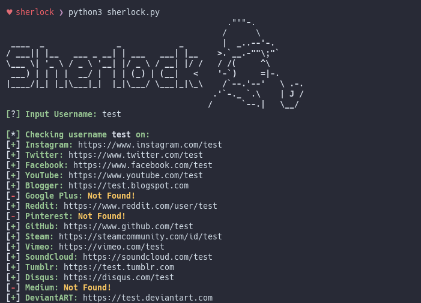

# Sherlock
> Find usernames across [social networks](https://github.com/sdushantha/sherlock/blob/master/sites.md) 

<p align="center">

</a>
</p>

## Installation

**NOTE**: Python 3.6 or higher is required.

```bash
# clone the repo
$ git clone https://github.com/sdushantha/sherlock.git

# change the working directory to sherlock
$ cd sherlock

# install the requirements
$ pip3 install -r requirements.txt
```

## Usage

```bash
$ python3 sherlock.py --help
usage: sherlock.py [-h] [--version] [--verbose] [--quiet] [--csv] [--tor] [--unique-tor]
                   USERNAMES [USERNAMES ...]

Sherlock: Find Usernames Across Social Networks (Version 2018.12.30)

positional arguments:
  USERNAMES             One or more usernames to check with social networks.

optional arguments:
  -h, --help            show this help message and exit
  --version             Display version information and dependencies.
  --verbose, -v, -d, --debug
                        Display extra debugging information.
  --quiet, -q           Disable debugging information (Default Option).
  --csv                 Create Comma-Separated Values (CSV) File.
  --tor, -t             Make requests over TOR; increases runtime; requires TOR to be installed and in system path.
  --unique-tor, -u      Make requests over TOR with new TOR circuit after each request; increases runtime; requires TOR to be installed and in system path.
```

For example, run ```python3 sherlock.py user123```, and all of the accounts
found will be stored in a text file with the username (e.g ```user123.txt```).

## License
MIT License

Copyright (c) 2018 Siddharth Dushantha
