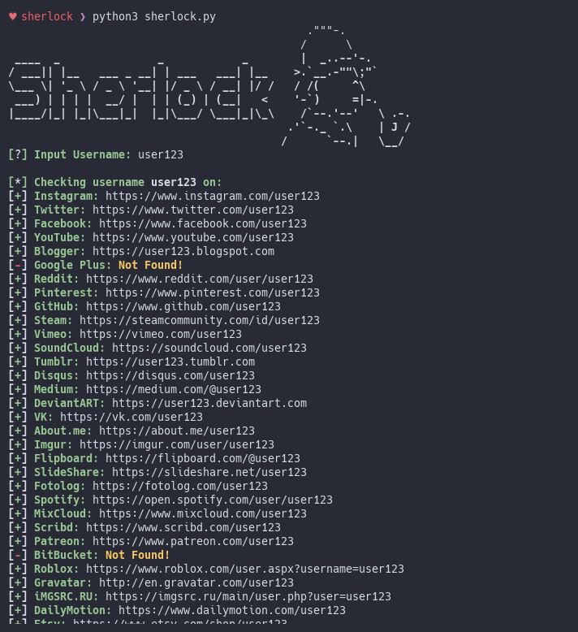

# Sherlock
> Find usernames across over 75 social networks 

<p align="center">

</a>
</p>

## Installation

```bash
# clone the repo
$ git clone https://github.com/sdushantha/sherlock.git

# change the working directory to sherlock
$ cd sherlock

# install the requirements
$ pip3 install -r requirements.txt
```

## Usage
Just run ```python3 sherlock.py```

All of the accounts found will be stored in a text file with their usename (e.g ```user123.txt```)


## License
MIT License

Copyright (c) 2018 Siddharth Dushantha
