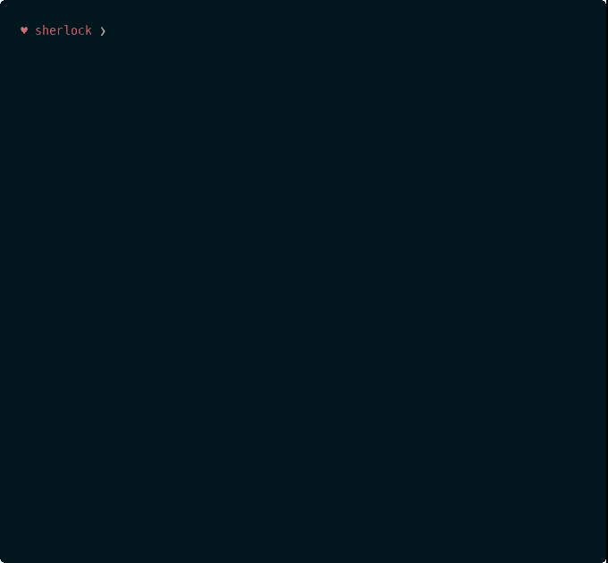

<p align=center>

  

  <br>
  <span>Hunt down social media accounts by username across <a href="https://github.com/theyahya/sherlock/blob/master/sites.md">social networks</a></span>
  <br>
  <a target="_blank" href="https://www.python.org/downloads/" title="Python version"></a>
  <a target="_blank" href="LICENSE" title="License: MIT"></a>
  <a target="_blank" href="https://travis-ci.com/TheYahya/sherlock/" title="Build Status"></a>
  <a target="_blank" href="https://twitter.com/intent/tweet?text=%F0%9F%94%8E%20Find%20usernames%20across%20social%20networks%20&url=https://github.com/TheYahya/sherlock&hashtags=hacking,%20osint,%20bugbounty,%20reconnaissance" title="Share on Tweeter"></a>
  <a target="_blank" href="http://sherlock-project.github.io/"></a>
  <a target="_blank" href="https://microbadger.com/images/theyahya/sherlock"></a>
</p>

<p align="center">
  <a href="#demo">Demo</a>
  &nbsp;&nbsp;&nbsp;|&nbsp;&nbsp;&nbsp;
  <a href="#installation">Installation</a>
  &nbsp;&nbsp;&nbsp;|&nbsp;&nbsp;&nbsp;
  <a href="#usage">Usage</a>
  &nbsp;&nbsp;&nbsp;|&nbsp;&nbsp;&nbsp;
  <a href="#docker-notes">Docker Notes</a>
  &nbsp;&nbsp;&nbsp;|&nbsp;&nbsp;&nbsp;
  <a href="#adding-new-sites">Adding New Sites</a>
</p>

<p align="center">
<a href="https://asciinema.org/a/223115">

</a>
</p>


## Demo

You can use this link to test Sherlock directly in your browser:
https://elody.com/scenario/plan/16/

## Installation

**NOTE**: Python 3.6 or higher is required.

```bash
# clone the repo
$ git clone https://github.com/sherlock-project/sherlock.git

# change the working directory to sherlock
$ cd sherlock

# install python3 and python3-pip if they are not installed

# install the requirements
$ python3 -m pip install -r requirements.txt
```
[](https://console.cloud.google.com/cloudshell/open?git_repo=https://github.com/sherlock-project/sherlock&tutorial=README.md)

## Usage

```bash
$ python3 sherlock.py --help
usage: sherlock.py [-h] [--version] [--verbose] [--rank]
                   [--folderoutput FOLDEROUTPUT] [--output OUTPUT] [--tor]
                   [--unique-tor] [--csv] [--site SITE_NAME]
                   [--proxy PROXY_URL] [--json JSON_FILE]
                   [--proxy_list PROXY_LIST] [--check_proxies CHECK_PROXY]
                   [--print-found]
                   USERNAMES [USERNAMES ...]

Sherlock: Find Usernames Across Social Networks (Version 0.9.3)

positional arguments:
  USERNAMES             One or more usernames to check with social networks.

optional arguments:
  -h, --help            show this help message and exit
  --version             Display version information and dependencies.
  --verbose, -v, -d, --debug
                        Display extra debugging information and metrics.
  --rank, -r            Present websites ordered by their Alexa.com global
                        rank in popularity.
  --folderoutput FOLDEROUTPUT, -fo FOLDEROUTPUT
                        If using multiple usernames, the output of the results
                        will be saved at this folder.
  --output OUTPUT, -o OUTPUT
                        If using single username, the output of the result
                        will be saved at this file.
  --tor, -t             Make requests over Tor; increases runtime; requires
                        Tor to be installed and in system path.
  --unique-tor, -u      Make requests over Tor with new Tor circuit after each
                        request; increases runtime; requires Tor to be
                        installed and in system path.
  --csv                 Create Comma-Separated Values (CSV) File.
  --site SITE_NAME      Limit analysis to just the listed sites. Add multiple
                        options to specify more than one site.
  --proxy PROXY_URL, -p PROXY_URL
                        Make requests over a proxy. e.g.
                        socks5://127.0.0.1:1080
  --json JSON_FILE, -j JSON_FILE
                        Load data from a JSON file or an online, valid, JSON
                        file.
  --proxy_list PROXY_LIST, -pl PROXY_LIST
                        Make requests over a proxy randomly chosen from a list
                        generated from a .csv file.
  --check_proxies CHECK_PROXY, -cp CHECK_PROXY
                        To be used with the '--proxy_list' parameter. The
                        script will check if the proxies supplied in the .csv
                        file are working and anonymous.Put 0 for no limit on
                        successfully checked proxies, or another number to
                        institute a limit.
  --print-found         Do not output sites where the username was not found.

```

For example to search for only one user:
```
python3 sherlock.py user123
```

To search for more than one user:
```
python3 sherlock.py user1 user2 user3
```

All of the accounts found will be stored in an individual text file with the corresponding username (e.g ```user123.txt```).

## Docker Notes
If you have docker installed you can build an image and run this as a container.

```
docker build -t mysherlock-image .
```

Once the image is built, sherlock can be invoked by running the following:

```
docker run --rm -t mysherlock-image user123
```

The optional ```--rm``` flag removes the container filesystem on completion to prevent cruft build-up. See: https://docs.docker.com/engine/reference/run/#clean-up---rm

The optional ```-t``` flag allocates a pseudo-TTY which allows colored output. See: https://docs.docker.com/engine/reference/run/#foreground

It is possible to use the following command to access the saved results:

```
docker run --rm -t -v "$PWD/results:/opt/sherlock/results" mysherlock-image -o /opt/sherlock/results/text.txt user123
```

The ```-v "$PWD/results:/opt/sherlock/results"``` option tells docker to create (or use) the folder `results` in the
present working directory and to mount it at `/opt/sherlock/results` on the docker container.
The `-o /opt/sherlock/results/text.txt` option tells `sherlock` to output the result.

Or you can simply use "Docker Hub" to run `sherlock`:
```
docker run theyahya/sherlock user123
```

### Using `docker-compose`

You can also use the `docker-compose.yml` file from the repository and use this command

```
docker-compose run sherlok -o /opt/sherlock/results/text.txt user123
```

## Adding New Sites

Please look at the Wiki entry on
[adding new sites](https://github.com/TheYahya/sherlock/wiki/Adding-Sites-To-Sherlock)
to understand the issues.

**NOTE**: Sherlock is not accepting adult sites in the standard list.

## Tests
If you are contributing to Sherlock, then Thank You!

Before creating a pull request with new development, please run the tests
to ensure that everything is working great.  It would also be a good idea to run the tests
before starting development to distinguish problems between your
environment and the Sherlock software.

The following is an example of the command line to run all the tests for
Sherlock.  This invocation hides the progress text that Sherlock normally
outputs, and instead shows the verbose output of the tests.

```
$ python3 -m unittest tests.all --buffer --verbose
```

Note that we do currently have 100% test coverage.  Unfortunately, some of
the sites that Sherlock checks are not always reliable, so it is common
to get response errors.

## Stargazers over time

[](https://starcharts.herokuapp.com/TheYahya/sherlock)

## License

MIT © [Yahya SayadArbabi](https://theyahya.com)<br/>
Original Creator - [Siddharth Dushantha](https://github.com/sdushantha)
