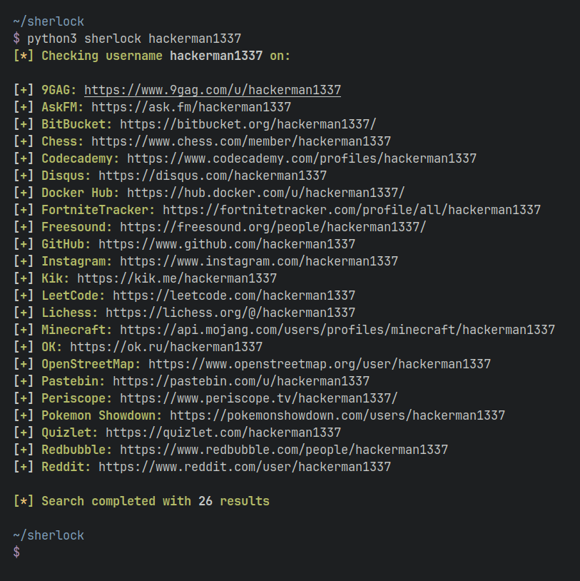

<p align=center>
  <br>
  <a href="https://sherlock-project.github.io/" target="_blank"></a>
  <br>
  <span>Hunt down social media accounts by username across <a href="https://github.com/sherlock-project/sherlock/blob/master/docs/sites.md">400+ social networks</a></span>
  <br>
</p>

<p align="center">
  <a href="https://github.com/sherlock-project/sherlock#installation">Installation</a>
  &nbsp;&nbsp;&nbsp;|&nbsp;&nbsp;&nbsp;
  <a href="https://github.com/sherlock-project/sherlock#usage">Usage</a>
  &nbsp;&nbsp;&nbsp;|&nbsp;&nbsp;&nbsp;
  <a href="https://github.com/ppfeister/sherlock/blob/feature/docu/docs/INSTALL.md#docker">Docker</a>
  &nbsp;&nbsp;&nbsp;|&nbsp;&nbsp;&nbsp;
  <a href="https://github.com/ppfeister/sherlock/blob/feature/docu/docs/CONTRIBUTING.md">Contributing</a>
</p>

<p align="center">

</a>
</p>


## Installation

[][ext_pypi] [][docs_docker] [][ext_brew]


| | Command | Notes |
| - | - | - |
| PyPI | `pipx install sherlock-project` | `pip` may be used in place of `pipx` |
| Docker | `docker pull sherlock/sherlock` | |
| Debian family | `apt install sherlock` | Kali, Parrot, Debian Testing and Sid |
| BlackArch | `pacman -S sherlock` |  |
| Homebrew | `brew install sherlock` | |

PyPI and DockerHub images are mainaintenced by the Sherlock Project. Others are community supported.

### Alternative guides and methods

- [See all alternative guides][docs_install]
- [Python package][docs_py]
- [Docker container][docs_docker]


## Usage

```console
$ sherlock --help
usage: sherlock [-h] [--version] [--verbose] [--folderoutput FOLDEROUTPUT]
                [--output OUTPUT] [--tor] [--unique-tor] [--csv] [--xlsx]
                [--site SITE_NAME] [--proxy PROXY_URL] [--json JSON_FILE]
                [--timeout TIMEOUT] [--print-all] [--print-found] [--no-color]
                [--browse] [--local] [--nsfw]
                USERNAMES [USERNAMES ...]

Sherlock: Find Usernames Across Social Networks (Version 0.14.3)

positional arguments:
  USERNAMES             One or more usernames to check with social networks.
                        Check similar usernames using {?} (replace to '_', '-', '.').

optional arguments:
  -h, --help            show this help message and exit
  --version             Display version information and dependencies.
  --verbose, -v, -d, --debug
                        Display extra debugging information and metrics.
  --folderoutput FOLDEROUTPUT, -fo FOLDEROUTPUT
                        If using multiple usernames, the output of the results will be
                        saved to this folder.
  --output OUTPUT, -o OUTPUT
                        If using single username, the output of the result will be saved
                        to this file.
  --tor, -t             Make requests over Tor; increases runtime; requires Tor to be
                        installed and in system path.
  --unique-tor, -u      Make requests over Tor with new Tor circuit after each request;
                        increases runtime; requires Tor to be installed and in system
                        path.
  --csv                 Create Comma-Separated Values (CSV) File.
  --xlsx                Create the standard file for the modern Microsoft Excel
                        spreadsheet (xlsx).
  --site SITE_NAME      Limit analysis to just the listed sites. Add multiple options to
                        specify more than one site.
  --proxy PROXY_URL, -p PROXY_URL
                        Make requests over a proxy. e.g. socks5://127.0.0.1:1080
  --json JSON_FILE, -j JSON_FILE
                        Load data from a JSON file or an online, valid, JSON file.
  --timeout TIMEOUT     Time (in seconds) to wait for response to requests (Default: 60)
  --print-all           Output sites where the username was not found.
  --print-found         Output sites where the username was found.
  --no-color            Don't color terminal output
  --browse, -b          Browse to all results on default browser.
  --local, -l           Force the use of the local data.json file.
  --nsfw                Include checking of NSFW sites from default list.
```

To search for only one user:
```bash
sherlock user123
```

To search for more than one user:
```bash
sherlock user1 user2 user3
```

Accounts found will be stored in an individual text file with the corresponding username (e.g ```user123.txt```).


## How to contribute to Sherlock

We would love to have you help us with the development of Sherlock. Each and every contribution is greatly valued!

Here are some things we would appreciate your help on:
- [Adding targets][docs_contrib_adding_targets]
- [Cleaning up existing targets][docs_contrib_removing_targets]
- [Restoring previously removed targets][docs_contrib_restoring_targets]

Head over to our __[Contributing][docs_contrib]__ page for additional info.

## Star History

<picture>
  <source media="(prefers-color-scheme: dark)" srcset="https://api.star-history.com/svg?repos=sherlock-project/sherlock&type=Date&theme=dark" />
  <source media="(prefers-color-scheme: light)" srcset="https://api.star-history.com/svg?repos=sherlock-project/sherlock&type=Date" />
  
</picture>

## License

MIT © Sherlock Project<br/>
Original Creator - [Siddharth Dushantha](https://github.com/sdushantha)

<!-- Reference Links -->

[docs_install]: /docs/INSTALL.md
[docs_docker]: /docs/INSTALL.md#docker
[docs_py]: /docs/INSTALL.md#python
[docs_contrib]: /docs/CONTRIBUTING.md
[docs_contrib_adding_targets]: /docs/CONTRIBUTING.md#adding-targets
[docs_contrib_removing_targets]: /docs/CONTRIBUTING.md#removing-targets
[docs_contrib_restoring_targets]: /docs/CONTRIBUTING.md#restoring-targets
[ext_pypi]: https://pypi.org/project/sherlock-project/
[ext_brew]: https://formulae.brew.sh/formula/sherlock
