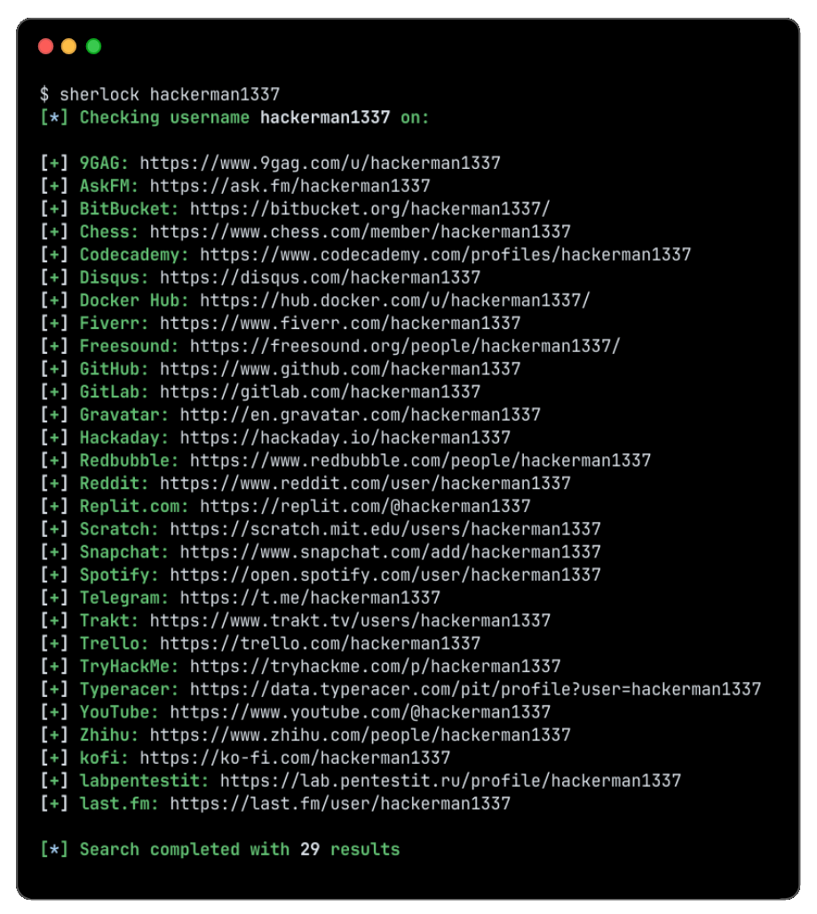

<!-- Sherlock Project README - Refreshed Look -->

<h1 align="center">🔍 Sherlock</h1>
<p align="center">
  <a href="https://sherlock-project.github.io/" target="_blank">
    
  </a>
</p>

<p align="center">
  🕵️ Hunt down social media accounts by username across <a href="https://sherlockproject.xyz/sites">400+ social networks</a>
</p>

<p align="center">
  <a href="https://sherlockproject.xyz/installation">📦 Installation</a> •
  <a href="https://sherlockproject.xyz/usage">🛠️ Usage</a> •
  <a href="https://sherlockproject.xyz/contribute">🤝 Contributing</a>
</p>

<p align="center">
  
</p>

---

## 🚀 Installation

> ⚠️ **Heads Up!**  
> Packages for **ParrotOS** and **Ubuntu 24.04** appear to be **broken**.  
> Use `pipx`, `pip`, or `Docker` instead.

| Method | Description |
|--------|-------------|
| `pipx install sherlock-project` | Use `pip` if `pipx` isn't available |
| `docker run -it --rm sherlock/sherlock` | Run via Docker |
| `dnf install sherlock-project` | Fedora package |

👉 Check out [other installation methods](https://sherlockproject.xyz/installation)

---

## 🔧 Usage

### 🔹 Single username

```bash
sherlock user123
```

### 🔹 Multiple usernames

```bash
sherlock user1 user2 user3
```

📁 Output will be saved as `username.txt` files.

---

### 💡 Command Help

```bash
$ sherlock --help
```

<details>
<summary>📜 Click to view full command list</summary>


```text
usage: sherlock [-h] [--version] [--verbose] [--folderoutput FOLDEROUTPUT]
                [--output OUTPUT] [--tor] [--unique-tor] [--csv] [--xlsx]
                [--site SITE_NAME] [--proxy PROXY_URL] [--json JSON_FILE]
                [--timeout TIMEOUT] [--print-all] [--print-found] [--no-color]
                [--browse] [--local] [--nsfw]
                USERNAMES [USERNAMES ...]

Sherlock: Find Usernames Across Social Networks (Version 0.14.3)

positional arguments:
  USERNAMES            One or more usernames to check with social networks.
                       Check similar usernames using {?} (replace to '_', '-', '.').

optional arguments:
  -h, --help           show this help message and exit
  --version            Display version information and dependencies.
  --verbose, -v, -d, --debug
                       Display extra debugging information and metrics.
  --folderoutput FOLDEROUTPUT, -fo FOLDEROUTPUT
                       If using multiple usernames, the output of the results will be
                       saved to this folder.
  --output OUTPUT, -o OUTPUT
                       If using single username, the output of the result will be saved
                       to this file.
  --tor, -t            Make requests over Tor; increases runtime; requires Tor to be
                       installed and in system path.
  --unique-tor, -u     Make requests over Tor with new Tor circuit after each request;
                       increases runtime; requires Tor to be installed and in system
                       path.
  --csv                Create Comma-Separated Values (CSV) File.
  --xlsx               Create the standard file for the modern Microsoft Excel
                       spreadsheet (xlsx).
  --site SITE_NAME     Limit analysis to just the listed sites. Add multiple options to
                       specify more than one site.
  --proxy PROXY_URL, -p PROXY_URL
                       Make requests over a proxy. e.g. socks5://127.0.0.1:1080
  --json JSON_FILE, -j JSON_FILE
                       Load data from a JSON file or an online, valid, JSON file.
  --timeout TIMEOUT    Time (in seconds) to wait for response to requests (Default: 60)
  --print-all          Output sites where the username was not found.
  --print-found        Output sites where the username was found.
  --no-color           Don't color terminal output
  --browse, -b         Browse to all results on default browser.
  --local, -l          Force the use of the local data.json file.
  --nsfw               Include checking of NSFW sites from default list.
```

</details>

---

## ☁️ Run in the Cloud (Apify)

Use [Apify](https://apify.com/netmilk/sherlock?fpr=sherlock) to run Sherlock **without installation** 🎉

[](https://apify.com/netmilk/sherlock?fpr=sherlock)

```bash
echo '{"usernames":["user123"]}' | apify call -so netmilk/sherlock
```

📖 Learn more about [Sherlock Actor](../.actor/README.md) and integrations with  
[API](https://apify.com/netmilk/sherlock/api?fpr=sherlock) • [CLI](https://docs.apify.com/cli/?fpr=sherlock) • [SDKs](https://docs.apify.com/sdk?fpr=sherlock)

---

## 🙌 Credits

Thanks to all the amazing contributors! ❤️

<a href="https://github.com/sherlock-project/sherlock/graphs/contributors">
  
</a>

---

## 📈 Star History

<picture>
  <source media="(prefers-color-scheme: dark)" srcset="https://api.star-history.com/svg?repos=sherlock-project/sherlock&type=Date&theme=dark" />
  <source media="(prefers-color-scheme: light)" srcset="https://api.star-history.com/svg?repos=sherlock-project/sherlock&type=Date" />
  
</picture>

---

## 📝 License

MIT © Sherlock Project  
Created by [Siddharth Dushantha](https://github.com/sdushantha)
