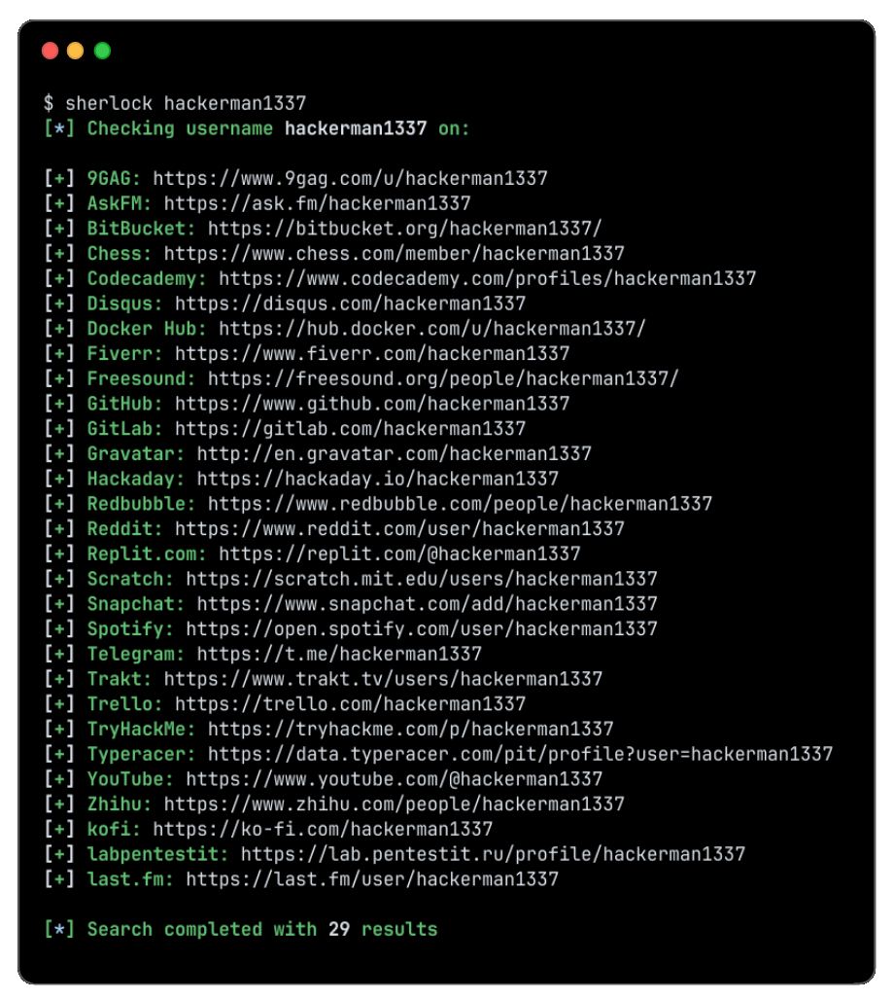

<p align="center">
  <br>
  <a href="https://sherlock-project.github.io/" target="_blank"></a>
  <br>
  <span>Hunt down social media accounts by username across <a href="https://sherlockproject.xyz/sites">400+ social networks</a></span>
  <br>
</p>

<p align="center">
  <a href="https://sherlockproject.xyz/installation">Installation</a>
  &nbsp;&nbsp;&nbsp;•&nbsp;&nbsp;&nbsp;
  <a href="https://sherlockproject.xyz/usage">Usage</a>
  &nbsp;&nbsp;&nbsp;•&nbsp;&nbsp;&nbsp;
  <a href="https://sherlockproject.xyz/contribute">Contributing</a>
</p>

<p align="center">

</p>


## Installation

> [!WARNING]  
> Packages for ParrotOS and Ubuntu 24.04, maintained by a third party, appear to be __broken__.  
> Users of these systems should defer to pipx/pip or Docker.

| Method | Notes |
| - | - |
| `pipx install sherlock-project` | `pip` may be used in place of `pipx` |
| `docker run -it --rm sherlock/sherlock` |
| `dnf install sherlock-project` | |

Community-maintained packages are available for Debian (>= 13), Ubuntu (>= 22.10), Homebrew, Kali, and BlackArch. These packages are not directly supported or maintained by the Sherlock Project.

See all alternative installation methods [here](https://sherlockproject.xyz/installation)

## General usage

To search for only one user:
```bash
sherlock user123
```

To search for more than one user:
```bash
sherlock user1 user2 user3
```

Accounts found will be stored in an individual text file with the corresponding username (e.g ```user123.txt```).

```console
$ sherlock --help
usage: sherlock [-h] [--version] [--verbose] [--folderoutput FOLDEROUTPUT]
                [--output OUTPUT] [--tor] [--unique-tor] [--csv] [--xlsx]
                [--site SITE_NAME] [--proxy PROXY_URL] [--json JSON_FILE]
                [--timeout TIMEOUT] [--print-all] [--print-found] [--no-color]
                [--browse] [--local] [--nsfw]
                USERNAMES [USERNAMES ...]

Sherlock: Find Usernames Across Social Networks (Version 0.14.3)

positional arguments:
  USERNAMES             One or more usernames to check with social networks.
                        Check similar usernames using {?} (replace to '_', '-', '.').

optional arguments:
  -h, --help            show this help message and exit
  --version             Display version information and dependencies.
  --verbose, -v, -d, --debug
                        Display extra debugging information and metrics.
  --folderoutput FOLDEROUTPUT, -fo FOLDEROUTPUT
                        If using multiple usernames, the output of the results will be
                        saved to this folder.
  --output OUTPUT, -o OUTPUT
                        If using single username, the output of the result will be saved
                        to this file.
  --tor, -t             Make requests over Tor; increases runtime; requires Tor to be
                        installed and in system path.
  --unique-tor, -u      Make requests over Tor with new Tor circuit after each request;
                        increases runtime; requires Tor to be installed and in system
                        path.
  --csv                 Create Comma-Separated Values (CSV) File.
  --xlsx                Create the standard file for the modern Microsoft Excel
                        spreadsheet (xlsx).
  --site SITE_NAME      Limit analysis to just the listed sites. Add multiple options to
                        specify more than one site.
  --proxy PROXY_URL, -p PROXY_URL
                        Make requests over a proxy. e.g. socks5://127.0.0.1:1080
  --json JSON_FILE, -j JSON_FILE
                        Load data from a JSON file or an online, valid, JSON file.
  --timeout TIMEOUT     Time (in seconds) to wait for response to requests (Default: 60)
  --print-all           Output sites where the username was not found.
  --print-found         Output sites where the username was found.
  --no-color            Don't color terminal output
  --browse, -b          Browse to all results on default browser.
  --local, -l           Force the use of the local data.json file.
  --nsfw                Include checking of NSFW sites from default list.
```
## AI-Powered Analysis 🤖

Sherlock now includes an **AI-powered analysis engine** that enhances search accuracy with confidence scoring, false positive detection, and optional LLM verification.

### Quick Start

```bash
# Enable AI analysis with confidence scores
sherlock --ai user123

# Filter results — only show ≥60% confidence
sherlock --ai --ai-filter 0.6 user123

# Show AI summary + related username suggestions
sherlock --ai --ai-summary --ai-suggest user123

# Enable LLM verification for ambiguous results (Gemini)
sherlock --ai --ai-llm user123
```

### AI Features

| Feature | Flag | Description |
| ------- | ---- | ----------- |
| Confidence Scoring | `--ai` | Color-coded confidence badges `[AI:85%]` on each result |
| Result Filtering | `--ai-filter 0.5` | Only show results above the confidence threshold (0.0–1.0) |
| Analysis Summary | `--ai-summary` | Boxed summary with stats: high/low confidence counts, categories |
| Username Suggestions | `--ai-suggest` | Suggests related usernames (separator variants, prefixes, etc.) |
| LLM Verification | `--ai-llm` | Calls Google Gemini API to verify ambiguous results |
| LLM API Key | `.env:GEMINI_API_KEY` | API key loaded from `.env` or environment variable |
| LLM Model | `--ai-model MODEL` | Model name (or env `SHERLOCK_AI_MODEL`, default: `gemini-3-flash-preview`) |

### How It Works

The AI engine performs **multi-layer analysis** on each HTTP response:

1. **Pattern Recognition** — Detects profile indicators (followers, posts, bio, join date) vs error patterns (404, not found, suspended)
2. **Structure Analysis** — Evaluates HTML structure, JSON APIs, Schema.org/OpenGraph metadata, content length
3. **Username Verification** — Checks if the username appears meaningfully in titles, headings, and structured data
4. **False Positive Detection** — Identifies parked domains, WAF blocks, bot detection, and default server pages
5. **LLM Verification** *(optional)* — For ambiguous results (35–75% confidence), asks Google Gemini to verify with a blended score (40% heuristic + 60% LLM)

Without `--ai-llm`, everything runs **locally with zero external calls**. The AI adds no new dependencies unless Gemini is enabled.
## Gemini API Key Setup

To use LLM features, create a `.env` file in your project root:

```
GEMINI_API_KEY=your-google-gemini-api-key
SHERLOCK_AI_MODEL=gemini-3-flash-preview
```

Or set the environment variable `GEMINI_API_KEY` before running Sherlock.

### Output Examples

**Terminal with `--ai`:**
```
[+] [AI:92%] GitHub: https://github.com/user123
[+] [AI:67%] Twitter: https://twitter.com/user123
      ⚠ Few profile indicators found in response
[~] [AI:28%] SomeSite: Filtered (low AI confidence)
```

**Terminal with `--ai --ai-summary`:**
```
╔══════════════════════════════════════════╗
║        AI Analysis Summary               ║
╠══════════════════════════════════════════╣
║  Sites checked:       400               ║
║  Accounts found:      12                ║
║  High confidence:     8                 ║
║  Low confidence:      2                 ║
║  Suspicious results:  1                 ║
║  Confidence rate:     67%               ║
╚══════════════════════════════════════════╝
```

**CSV/XLSX exports** with `--ai` include extra columns: `ai_confidence`, `ai_level`, `ai_category`.

## Apify Actor Usage [](https://apify.com/netmilk/sherlock?fpr=sherlock)

<a href="https://apify.com/netmilk/sherlock?fpr=sherlock"></a>

You can run Sherlock in the cloud without installation using the [Sherlock Actor](https://apify.com/netmilk/sherlock?fpr=sherlock) on [Apify](https://apify.com?fpr=sherlock) free of charge.

``` bash
$ echo '{"usernames":["user123"]}' | apify call -so netmilk/sherlock
[{
  "username": "user123",
  "links": [
    "https://www.1337x.to/user/user123/",
    ...
  ]
}]
```

Read more about the [Sherlock Actor](../.actor/README.md), including how to use it programmatically via the Apify [API](https://apify.com/netmilk/sherlock/api?fpr=sherlock), [CLI](https://docs.apify.com/cli/?fpr=sherlock) and [JS/TS and Python SDKs](https://docs.apify.com/sdk?fpr=sherlock).

## Credits

Thank you to everyone who has contributed to Sherlock! ❤️

<a href="https://github.com/sherlock-project/sherlock/graphs/contributors">
  
</a>

## Star History

<picture>
  <source media="(prefers-color-scheme: dark)" srcset="https://api.star-history.com/svg?repos=sherlock-project/sherlock&type=Date&theme=dark" />
  <source media="(prefers-color-scheme: light)" srcset="https://api.star-history.com/svg?repos=sherlock-project/sherlock&type=Date" />
  
</picture>

## License

MIT © Sherlock Project<br/>
Original Creator - [Siddharth Dushantha](https://github.com/sdushantha)

<!-- Reference Links -->

[ext_pypi]: https://pypi.org/project/sherlock-project/
[ext_brew]: https://formulae.brew.sh/formula/sherlock
