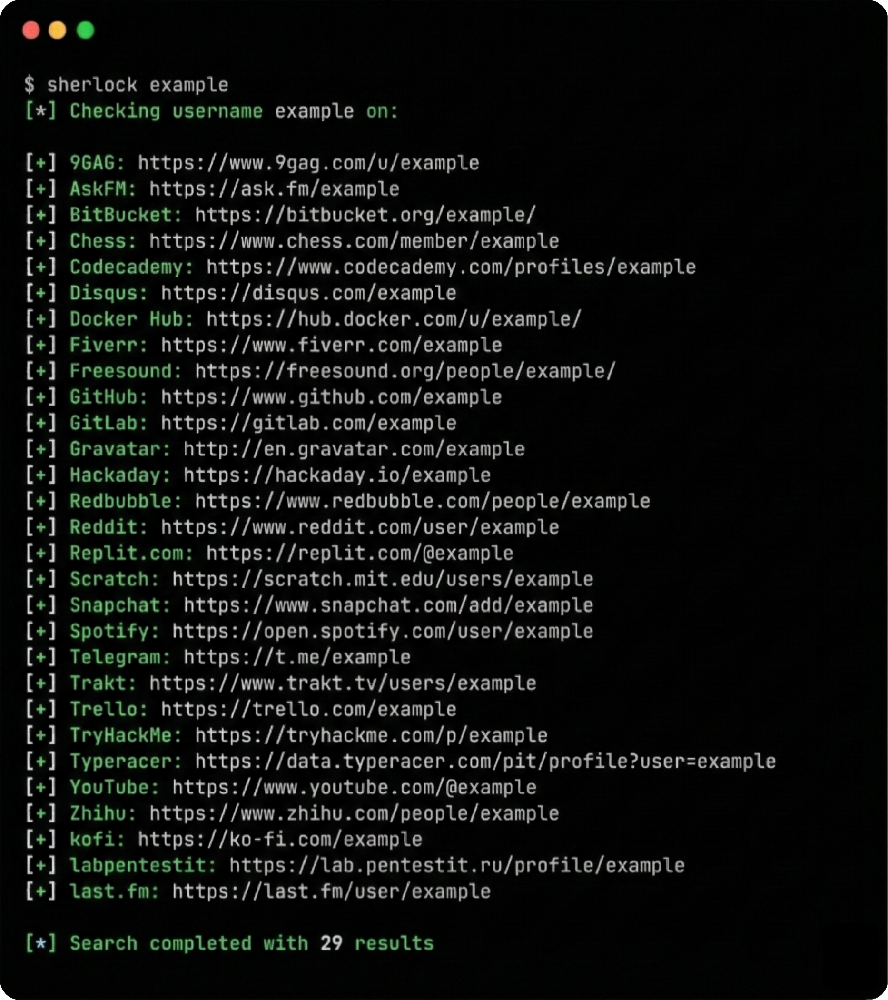

<p align="center">
  <br>
  <a href="https://sherlock-project.github.io/" target="_blank"></a>
  <br>
  <span>Hunt down social media accounts by username across <a href="https://sherlockproject.xyz/sites">400+ social networks</a></span>
  <br>
</p>

<p align="center">
  <a href="https://sherlockproject.xyz/installation">Installation</a>
  &nbsp;&nbsp;&nbsp;•&nbsp;&nbsp;&nbsp;
  <a href="https://sherlockproject.xyz/usage">Usage</a>
  &nbsp;&nbsp;&nbsp;•&nbsp;&nbsp;&nbsp;
  <a href="https://sherlockproject.xyz/contribute">Contributing</a>
</p>

<p align="center">

</p>


## Installation

<p align="center">
  <a href="https://www.osint.industries/" target="_blank"></a>
</p>

> [!WARNING]  
> Packages for ParrotOS and Ubuntu 24.04, maintained by a third party, appear to be __broken__.  
> Users of these systems should defer to [`uv`](https://docs.astral.sh/uv/)/`pipx`/`pip` or Docker.

| Method | Notes |
| - | - |
| `pipx install sherlock-project` | `pip` or [`uv`](https://docs.astral.sh/uv/) may be used in place of `pipx` |
| `docker run -it --rm sherlock/sherlock` |
| `dnf install sherlock-project` | |

Community-maintained packages are available for Debian (>= 13), Ubuntu (>= 22.10), Homebrew, Kali, and BlackArch. These packages are not directly supported or maintained by the Sherlock Project.

See all alternative installation methods [here](https://sherlockproject.xyz/installation).

## General usage

To search for only one user:
```bash
sherlock user123
```

To search for more than one user:
```bash
sherlock user1 user2 user3
```

Accounts found will be stored in the `results/` directory (e.g. `results/user123.txt`). If running
via the provided Docker Compose setup, these results are automatically mapped and collected into
the local `results/` folder.

```console
$ sherlock --help
usage: sherlock [-h] [--version] [--verbose] [--folderoutput FOLDEROUTPUT] [--output OUTPUT] [--csv] [--xlsx] [--site SITE_NAME] [--proxy PROXY_URL] [--dump-response]
                [--json JSON_FILE] [--timeout TIMEOUT] [--print-all] [--print-found] [--no-color] [--browse] [--local] [--nsfw] [--txt] [--ignore-exclusions]
                USERNAMES [USERNAMES ...]

Sherlock: Find Usernames Across Social Networks (Version 0.16.0)

positional arguments:
  USERNAMES             One or more usernames to check with social networks. Check similar usernames using {?} (replace to '_', '-', '.').

options:
  -h, --help            show this help message and exit
  --version             Display version information and dependencies.
  --verbose, -v, -d, --debug
                        Display extra debugging information and metrics.
  --folderoutput FOLDEROUTPUT, -fo FOLDEROUTPUT
                        If using multiple usernames, the output of the results will be saved to this folder.
  --output OUTPUT, -o OUTPUT
                        If using single username, the output of the result will be saved to this file.
  --csv                 Create Comma-Separated Values (CSV) File.
  --xlsx                Create the standard file for the modern Microsoft Excel spreadsheet (xlsx).
  --site SITE_NAME      Limit analysis to just the listed sites. Add multiple options to specify more than one site.
  --proxy PROXY_URL, -p PROXY_URL
                        Make requests over a proxy. e.g. socks5://127.0.0.1:1080
  --dump-response       Dump the HTTP response to stdout for targeted debugging.
  --json JSON_FILE, -j JSON_FILE
                        Load data from a JSON file or an online, valid, JSON file. Upstream PR numbers also accepted.
  --timeout TIMEOUT     Time (in seconds) to wait for response to requests (Default: 60)
  --print-all           Output sites where the username was not found.
  --print-found         Output sites where the username was found (also if exported as file).
  --no-color            Don't color terminal output
  --browse, -b          Browse to all results on default browser.
  --local, -l           Force the use of the local data.json file.
  --nsfw                Include checking of NSFW sites from default list.
  --txt                 Enable creation of a txt file
  --ignore-exclusions   Ignore upstream exclusions (may return more false positives)
```

## Docker & SonarQube Automation

A `Makefile` and `docker-compose.yml` are provided to simplify development and static code
analysis. The setup uses a multi-container architecture where the scanner communicates with the
SonarQube server over an internal Docker network.

### Static Code Analysis Setup

1.  **Start the SonarQube Server:**
    Run the following command to pull and start the SonarQube Community Edition:
    ```bash
    make sonar-up
    ```
    *   **Dashboard:** [http://localhost:9000](http://localhost:9000)
    *   **Default Credentials:** `admin` / `admin` (you will be prompted to change the password on first login).

2.  **Generate an Analysis Token:**
    *   Log into the SonarQube dashboard.
    *   If it's your first time, select **"Create a local project"**.
    *   Set the **Project Key** and **Display Name** to `sherlock`.
    *   Select **"Use the global setting"** for the main branch.
    *   When prompted to "Analyze your project", choose **"Locally"**.
    *   Generate a **Project Analysis Token**. Give it a name (e.g., `sherlock-token`) and click **Generate**.
    *   **Copy the token immediately**; you won't be able to see it again.

3.  **Configure your Environment:**
    Create a `.env` file in the project root to store your token securely:
    ```bash
    cp .env.example .env
    ```
    Open `.env` and update the `SONAR_TOKEN` variable:
    ```env
    SONAR_TOKEN=sqp_your_newly_generated_token_here
    ```

4.  **Run the Scan:**
    Once configured, you can trigger the analysis at any time:
    ```bash
    make sonar-scan
    ```
    The results will be available in the SonarQube dashboard.

### Docker Compose Architecture

The project's `docker-compose.yml` defines three main components:
*   **`sherlock`**: The application container for running the tool itself.
*   **`sonarqube`**: The server that hosts the dashboard and stores analysis reports. It uses
    persistent volumes (`sonarqube_data`, `sonarqube_extensions`, `sonarqube_logs`) to ensure your
    data survives container restarts.
*   **`sonar-scanner`**: A transient container that runs the `sonar-scanner-cli`, performs the
    analysis on the source code, and pushes the results to the `sonarqube` server via the internal
    network.

### Makefile Commands

| Command | Description |
| - | - |
| `make build` | Builds the Sherlock Docker image from local source. |
| `make sonar-up` | Starts SonarQube with a 5-minute graceful shutdown period to prevent data corruption. |
| `make sonar-down` | Stops the SonarQube container. |
| `make sonar-scan` | Runs the Sonar Scanner CLI via Docker. Supports `.env` or `token=...` override. |
| `make run user=NAME` | Runs the local Sherlock build for a specific username. |
| `make clean` | Wipes all containers and persistent SonarQube volumes. |
| `make nuke` | Stop all services, remove volumes, networks and images. |

## Credits

Thank you to everyone who has contributed to Sherlock! ❤️

<a href="https://github.com/sherlock-project/sherlock/graphs/contributors">
  
</a>

## Star History

<picture>
  <source media="(prefers-color-scheme: dark)" srcset="https://api.star-history.com/svg?repos=sherlock-project/sherlock&type=Date&theme=dark" />
  <source media="(prefers-color-scheme: light)" srcset="https://api.star-history.com/svg?repos=sherlock-project/sherlock&type=Date" />
  
</picture>

## License

MIT © Sherlock Project<br/>
Creator - [Siddharth Dushantha](https://github.com/sdushantha)

<!-- Reference Links -->

[ext_pypi]: https://pypi.org/project/sherlock-project/
[ext_brew]: https://formulae.brew.sh/formula/sherlock
