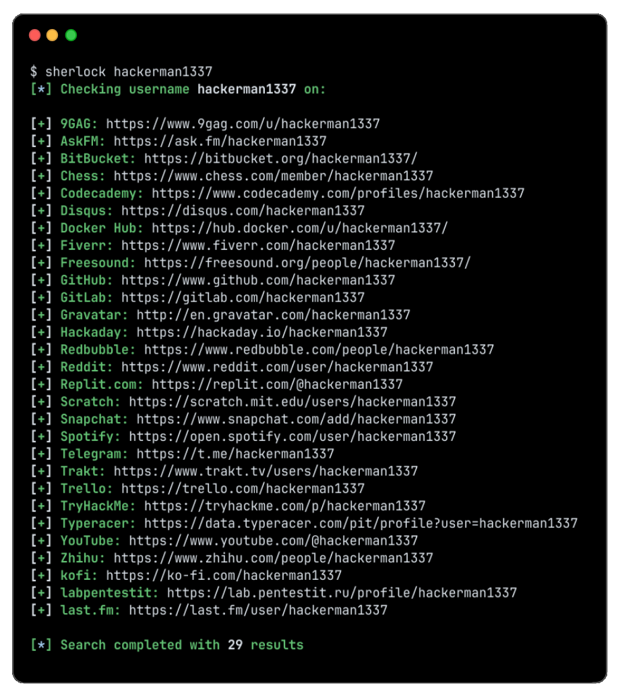

   
  
   
  在 <a href="https://sherlockproject.xyz/sites">400+ 个社交网站</a> 上追踪用户名
   

  <a href="https://sherlockproject.xyz/installation">安装</a>
  &nbsp;&nbsp;&nbsp;|&nbsp;&nbsp;&nbsp;
  <a href="https://sherlockproject.xyz/usage">使用方法</a>
  &nbsp;&nbsp;&nbsp;|&nbsp;&nbsp;&nbsp;
  <a href="https://sherlockproject.xyz/contribute">参与贡献</a>

## 安装

| 安装方式 | 说明 |
| - | - |
| `pipx install sherlock-project` | 也可以使用 pip 代替 pipx |
| `docker run -it --rm sherlock/sherlock` | Docker 容器方式 |
| `dnf install sherlock-project` | Fedora/RHEL 系统 |

查看所有安装方式请访问 [这里](https://sherlockproject.xyz/installation)

## 基本使用

搜索单个用户名:
`bash
sherlock user123
`

搜索多个用户名:
`bash
sherlock user1 user2 user3
`

找到的账号将被保存在以用户名命名的文本文件中（例如 user123.txt）。

## 致谢

感谢所有为 Sherlock 做出贡献的人！

## 许可证

MIT - Sherlock Project
原作者 - Siddharth Dushantha
